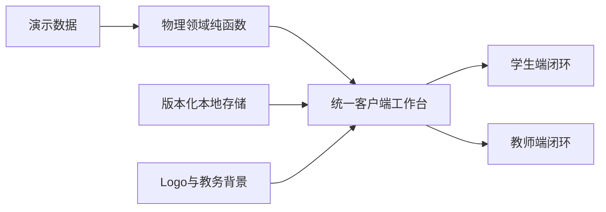

# 依赖关系

```mermaid
flowchart LR
  data[演示数据] --> physics[物理领域纯函数]
  physics --> app[统一客户端工作台]
  store[版本化本地存储] --> app
  app --> student[学生端闭环]
  app --> teacher[教师端闭环]
  assets[Logo与教务背景] --> app
```
